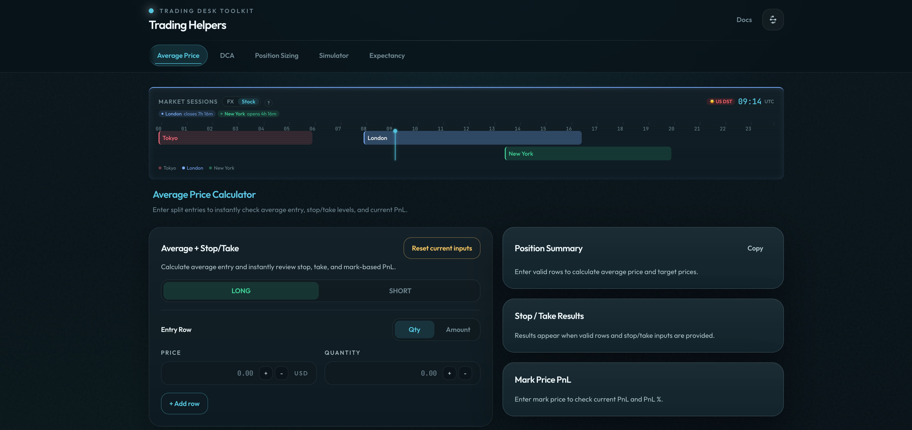

<p align="center">
  <h1 align="center"><b>Trading Helpers</b></h1>
  <p align="center">
    All-in-One Trading Calculator Workspace
    <br />
    <br />
    <a href="https://tradinghelpers.com">Website</a>
    ·
    <a href="https://github.com/richcire/trading-helpers/issues">Issues</a>
  </p>
</p>

<p align="center">
  
  
  
  
</p>

## About Trading Helpers

Trading Helpers is an all-in-one calculator workspace built for traders who need precise, reliable tools for position management, risk calculation, and trade analysis. It brings together essential trading calculators into a single, fast, and intuitive interface — supporting multiple languages, currencies, and trading scenarios.

## Features

**Average Price Calculator** — Calculate weighted average entry price across multiple entries with stop loss, take profit, and P&L tracking.<br/>
**DCA Calculator** — Simulate dollar cost averaging into existing positions and calculate new average price, breakeven price, and distance to breakeven.<br/>
**Position Sizing** — Determine optimal position size based on risk tolerance, with leverage and margin requirement calculations.<br/>
**Trade Simulator** — Visualize P&L across a range of prices with interactive charts, multiple Y-axis modes, and min/max identification.<br/>
**Expectancy Calculator** — Calculate trade expectancy and break-even win rate with interactive curve visualization.<br/>
**Calculation Tooltips** — Every result shows the full formula, substituted values, and step-by-step calculation process.

## Tech Stack

- React 19
- TypeScript
- Vite
- Tailwind CSS
- Zustand (State Management)
- Recharts (Charts)
- React Router

## Getting Started

```bash
# Clone the repository
git clone https://github.com/richcire/trading-helpers.git

# Install dependencies
pnpm install

# Start development server
pnpm dev
```

## License

MIT License
